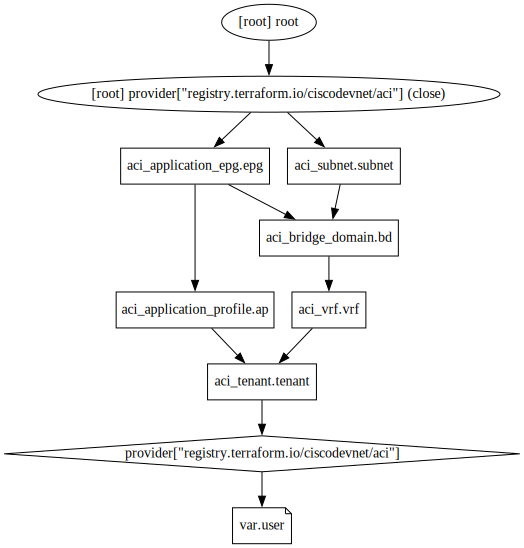
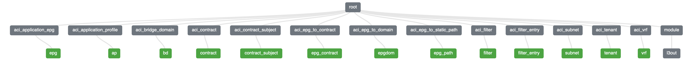
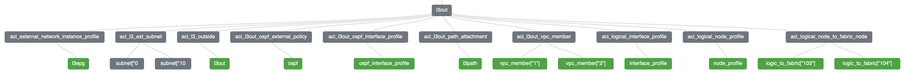

# Summary

This repository contains three Terraform demos automating Cisco ACI that were presented during the **Datacenter Automation Days** webinars in AMER. 
# Demos
### Demo 1
Extremely basic Terraform configuration file automating deployment of a basic 3-tier web application on Cisco ACI. No variables, flow control, nested loops, etc.
<p align="center">

</p>

### Demo 2
Same ACI configuration as Demo 1 but showcases variables, flow control, etc.  
<p align="center">

</p>

### Demo 3
Terraform config to enable communication between EPG and L3Out across ACI fabric. Showcases variables, flow control, and module usage.
<p align="center">

</p>
<p align="center">

</p>

# Instructions
These playbooks have been tested with Terraform version 1.3.1 and Cisco ACI collection version 2.6.0

To run the demo, use the following commands:
```
$ terraform init
$ terraform plan
$ terraform apply
```

To undeploy configuration:
```
$ terraform destroy
```

